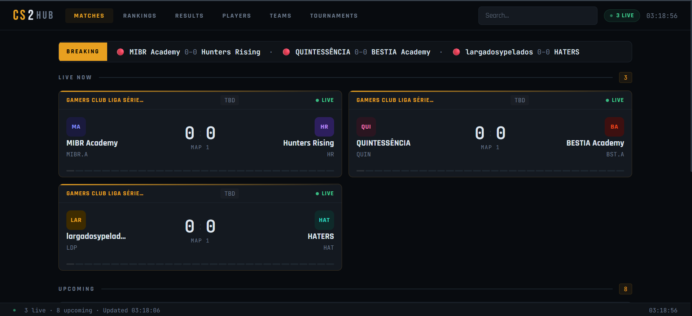
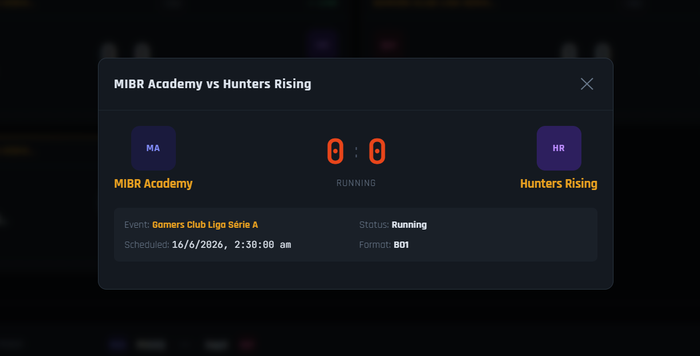
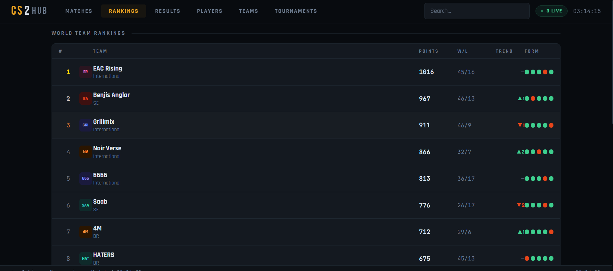
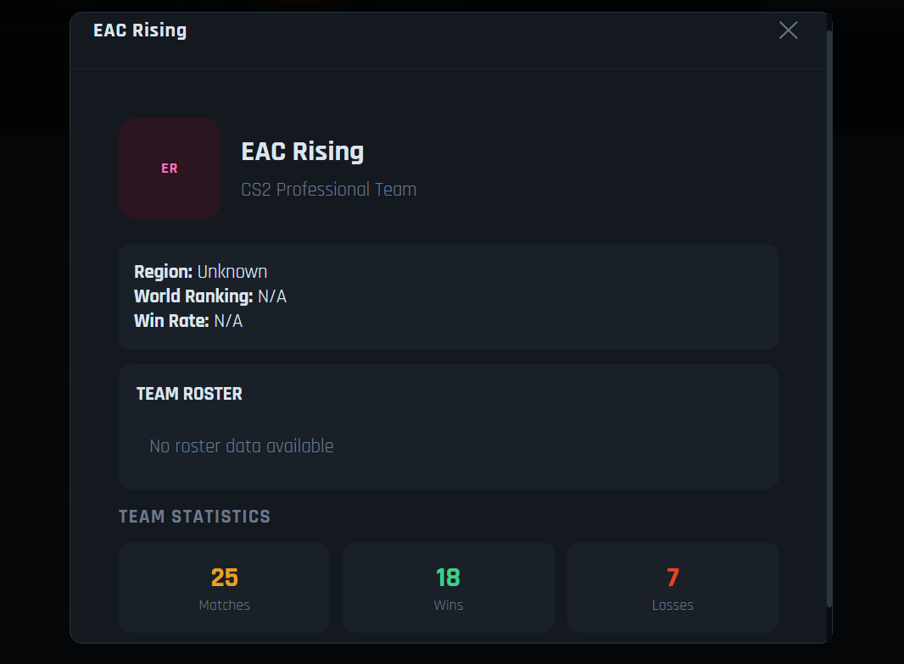
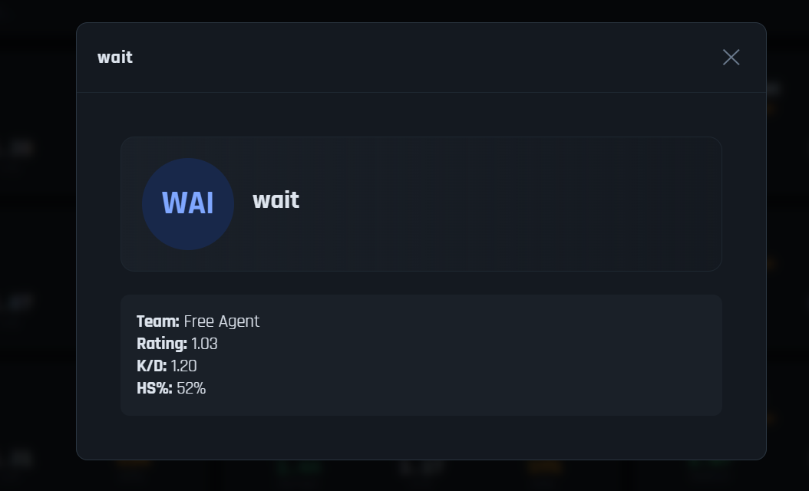
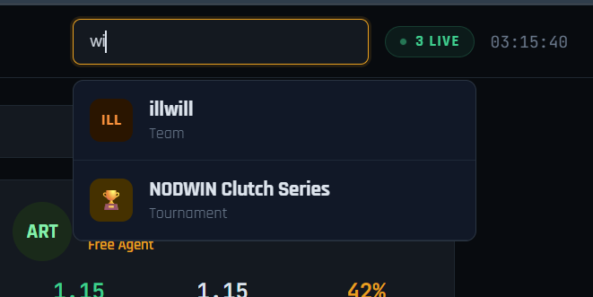
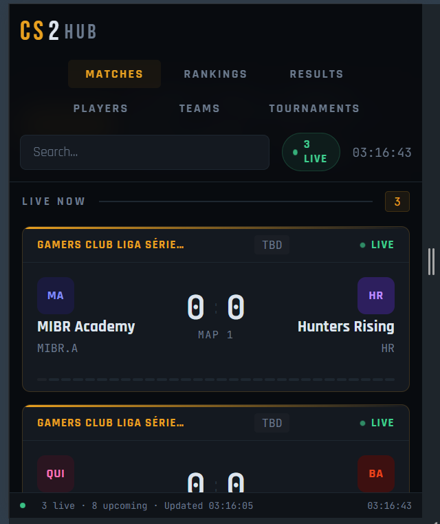
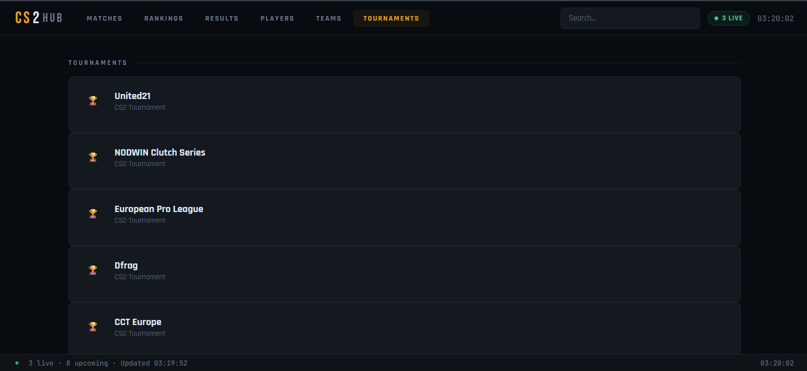
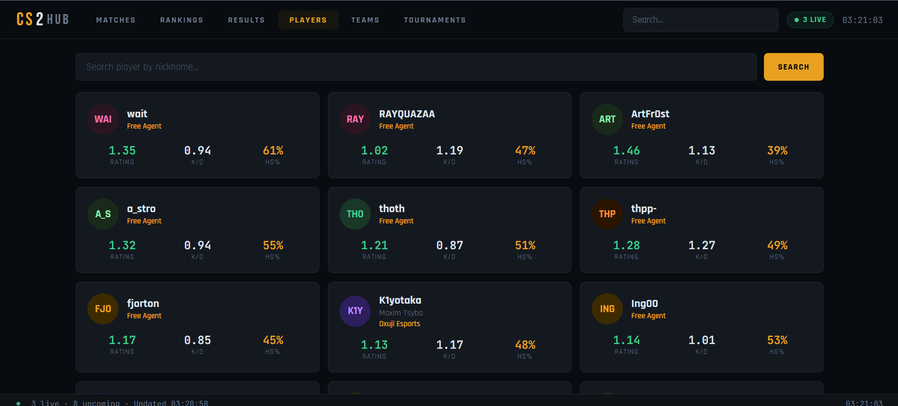

# 🎮 CS2Hub - Full Stack CS2 Esports Analytics Platform

## 🌐 Live Project

- Frontend: https://cs-2-hub-five.vercel.app
- Backend API: https://cs2hub-backend.onrender.com
- GitHub Repository: https://github.com/Veekshith18/CS2HUB

---

## 📌 Overview

CS2Hub is a full-stack esports analytics web application inspired by VLR.gg, developed to provide real-time Counter-Strike 2 match information, live scores, upcoming schedules, team rankings, player statistics, tournament details, and an advanced global search system.

The application integrates external esports APIs through a custom Express.js backend, ensuring secure API communication and delivering a responsive, modern user interface built using HTML, CSS, and JavaScript.

---

## ✨ Key Features

- 🔴 Live CS2 match tracking
- 📅 Upcoming match schedules
- 📰 Match results and details
- 🌍 World team rankings
- 👥 Team profile modals with statistics
- 🎯 Player profiles and performance statistics
- 🏆 Tournament information pages
- 🔎 Global search for teams, players, and tournaments
- 🖼️ Dynamic team logo generation
- 📱 Fully responsive design for mobile and desktop
- ⚡ Asynchronous API communication using Fetch API

---

# 🖼️ Application Screenshots

## 🔴 Live Match Dashboard



---

## 🎮 Match Details Modal



---

## 🌍 Team Rankings



---

## 👥 Team Profile



---

## 👤 Player Profile



---

## 🔎 Global Search



---

## 📱 Mobile Responsive Design



---

## 🏆 Tournament Page



---

## 🎯 Players Statistics Page



---

# 🛠️ Technology Stack

## Frontend
- HTML5
- CSS3
- JavaScript (ES6)
- Responsive Web Design

## Backend
- Node.js
- Express.js
- REST API Development

## External API
- PandaScore API

## Development & Deployment Tools
- Git
- GitHub
- Vercel (Frontend Deployment)
- Render (Backend Deployment)

---

# 📂 Project Architecture

```
CS2Hub
│
├── backend/
│   ├── server.js
│   ├── package.json
│   ├── .env
│
├── css/
│   └── style.css
│
├── js/
│   └── script.js
│
├── screenshots/
│   ├── home-live-matches.png
│   ├── match-details-modal.png
│   ├── rankings-page.png
│   ├── team-profile-modal.png
│   ├── player-profile-modal.png
│   └── more screenshots...
│
├── index.html
├── README.md
└── .gitignore
```

---

# 💻 Engineering Highlights

- Designed a clean frontend architecture with separate CSS and JavaScript modules.
- Built an Express.js backend proxy to protect API keys using environment variables.
- Implemented asynchronous data fetching and real-time UI updates.
- Developed reusable components such as match cards, player cards, team cards, and interactive modals.
- Created a global search engine for teams, players, and tournaments.
- Optimized the user interface for different screen sizes and mobile devices.
- Managed version control and collaboration workflow using Git and GitHub.
- Deployed a production-ready application using Vercel and Render.

---

# 🚀 Running the Project Locally

### 1. Clone the repository

```bash
git clone https://github.com/Veekshith18/CS2HUB.git
```

### 2. Navigate to backend

```bash
cd backend
```

### 3. Install dependencies

```bash
npm install
```

### 4. Create `.env` file

```env
PANDASCORE_API_KEY=8Ixu0UWpHY07fXI7NMmqSyGQ5w60gaICH3dd46Qe0nvBQxdmtJI
```

### 5. Start the backend server

```bash
npm start
```

### 6. Open the frontend

Open `index.html` using a browser or Live Server.

---

# 🔮 Future Improvements

- User authentication and personalized profiles
- Favorite teams and player tracking
- Advanced player analytics and historical statistics
- Additional esports game support
- Enhanced match statistics and visualizations

---

# 👨‍💻 Developer

**SWARNAPUDI VEEKSHITH**

---

⭐ If you found this project interesting, feel free to explore the repository.